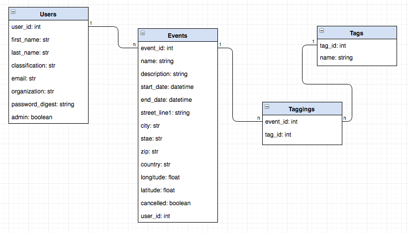
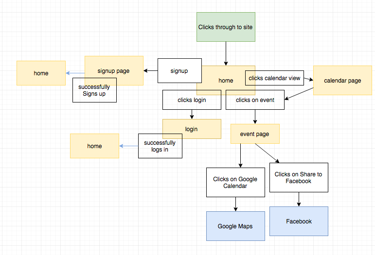

# group project for MIS 4397 fall 2016 - University of Houston

view project [here](https://afternoon-lowlands-61790.herokuapp.com/)

This was our main project for the course. In this project we got to utilize git for the first time and work as a team to get this app working by demo day.
The main idea for this app was to have a website that the university could use to display all events going on campus in one centralized website. The main users of the web app would be student org leaders, or the people in charge of hosting events on campus. Students would use the website to find campus events they were interested in attending.

#### Tools Used
- Rails
- Bootstrap
- SASS
- Javascript
- Gravatar

- - - -

### Data Model

### Site Map

